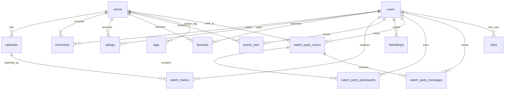

# Data model

## Overview

Aniyume uses a relational data model centered around anime catalog data, user activity, social interactions, and realtime watch party rooms.

Main domains:

- catalog: `anime`, `episodes`, `tags`, `anime_tag`;
- users/auth: `users`, `roles`, `role_user`, `personal_access_tokens`;
- user activity: `favorites`, `ratings`, `comments`, `watch_history`, `anime_user`;
- social: `friendships`;
- watch party: `watch_party_rooms`, `watch_party_participants`, `watch_party_messages`;
- operations: `import_logs`, `audit_logs`, `jobs`, `cache`, `sessions`.

## ERD



## Core tables

### users

Purpose: application users.

Important fields:

- `id`
- `name`
- `email`
- `password`
- `avatar`
- `bio`
- `custom_status`
- `is_online`
- `is_premium`
- `email_verified_at`
- timestamps

Relations:

- many comments;
- many ratings;
- many favorites;
- many watch history records;
- many anime via `anime_user`;
- many roles via `role_user`;
- friends via `friendships`.

### roles / role_user

Purpose: role-based access control.

Used for admin access:

```php
$user->hasRole('admin')
```

Admin routes require:

```php
['auth', 'admin']
```

### anime

Purpose: anime catalog entity.

Important fields include:

- `id`
- `title`
- `slug`
- `description`
- `poster_url`
- `status`
- `type`
- `year`
- `rating`
- `popularity`
- `external_id`
- `external_source`
- `shikimori_id`
- `aired_from`
- `aired_to`
- `number_of_episodes`

Status values:

- `planned`
- `ongoing`
- `finished`
- `paused`

Type values:

- `tv`
- `movie`
- `ova`
- `ona`
- `special`
- `music`

### episodes

Purpose: playable episodes for anime.

Important fields:

- `id`
- `anime_id`
- `episode_number`
- `season_number`
- `title`
- source/player fields
- timestamps

Relation:

- belongs to `anime`.

### tags / anime_tag

Purpose: genres/categories/tags.

`tags` replaces older unused `Genre` model.

Fields:

- `id`
- `name`
- `slug`

Many-to-many:

```text
anime <-> anime_tag <-> tags
```

## User activity tables

### anime_user

Purpose: user's anime list and progress summary.

Important fields:

- `user_id`
- `anime_id`
- `status`
- `episodes_watched`
- `last_watched_at`
- timestamps

User list statuses:

- `watching`
- `planned`
- `completed`
- `on_hold`
- `dropped`

Special API status:

- `not_watching` means detach from list.

### watch_history

Purpose: detailed watching progress per episode.

Important fields:

- `user_id`
- `episode_id`
- `progress`
- `delta_time`
- `completed`
- timestamps

Used by:

- watch tracker;
- last watched episode;
- user statistics.

### favorites

Purpose: user's favorite anime.

Important fields:

- `user_id`
- `anime_id`
- timestamps

### ratings

Purpose: user ratings for anime.

Important fields:

- `user_id`
- `anime_id`
- `score`
- timestamps

### comments

Purpose: comments under anime.

Important fields:

- `user_id`
- `anime_id`
- `content`
- moderation/status fields if present
- timestamps

## Social tables

### friendships

Purpose: friend requests and accepted friendships.

Fields:

- `user_id`
- `friend_id`
- `status`: `pending`, `accepted`, `rejected`
- timestamps

Constraints:

- unique pair `user_id`, `friend_id`.

## Watch Party tables

### watch_party_rooms

Purpose: realtime co-watching room.

Likely fields:

- `id`
- `code`
- `host_user_id`
- `anime_id`
- `episode_number`
- state fields
- timestamps

### watch_party_participants

Purpose: users currently/previously participating in room.

Likely fields:

- `room_id`
- `user_id`
- `is_host`
- timestamps

### watch_party_messages

Purpose: chat messages inside watch party.

Fields:

- `room_id`
- `user_id`
- `message`
- `type`: `message` / `system`
- timestamps

## Operational tables

### import_logs

Purpose: track import jobs.

Important fields:

- `import_type`
- `started_at`
- `finished_at`
- `status`
- counters: processed/created/updated/skipped
- `errors`

### audit_logs

Purpose: admin/security audit trail.

### blacklisted_anime

Purpose: skip specific external anime records during import.

### personal_access_tokens

Purpose: Laravel Sanctum tokens.

### jobs

Purpose: queued jobs when `QUEUE_CONNECTION=database`.

## Removed/legacy entities

Removed models:

- `Studio`
- `Genre`
- `UserVideo`
- `UserCollection`

Removed tables via new migration:

- `user_videos`
- `user_collections`
- `collection_anime`

Not used:

- separate `studios`/`genres` tables;
- separate `anime_studio`/`anime_genre` pivots.

## Data integrity notes

- Most user-owned tables should cascade on user deletion.
- Anime-related records should cascade or be cleaned via admin operations.
- Watch Party rooms/messages should preserve enough data for current room state but can be archived/cleaned later.
- Import logs should not be deleted automatically without retention policy.

## Future improvements

For stronger diploma-level data architecture:

1. add explicit DB constraints for all pivot uniqueness;
2. document indexes for search/filter paths;
3. add retention policy for watch history/import logs;
4. add database seeders for demo defense;
5. add ERD image export for thesis text.
