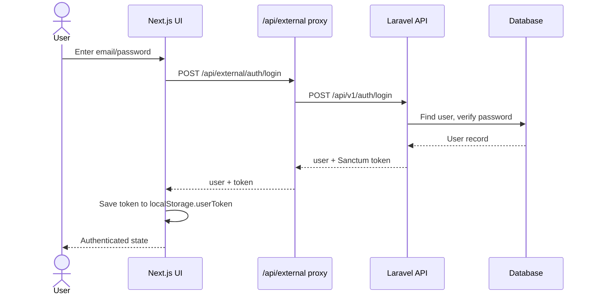
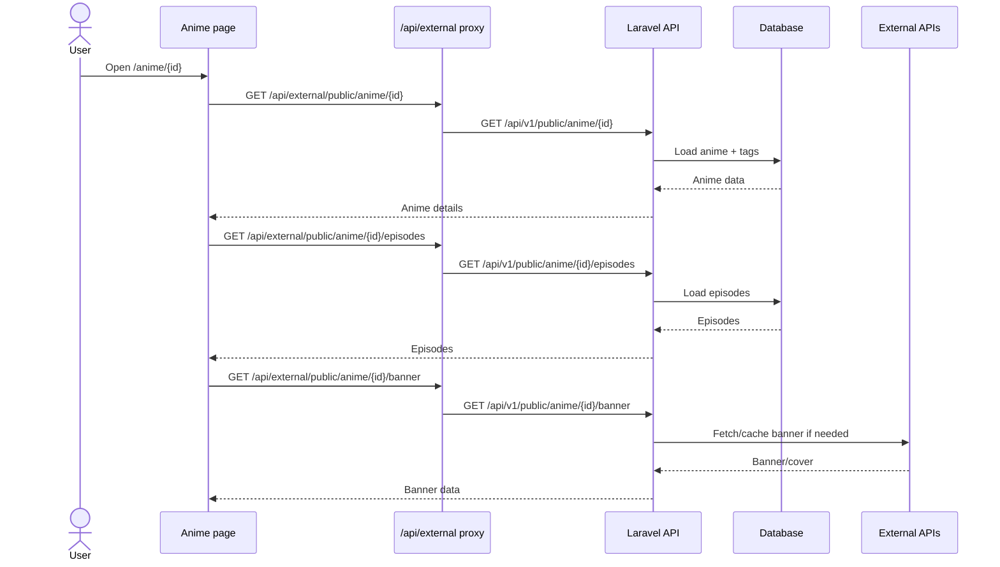
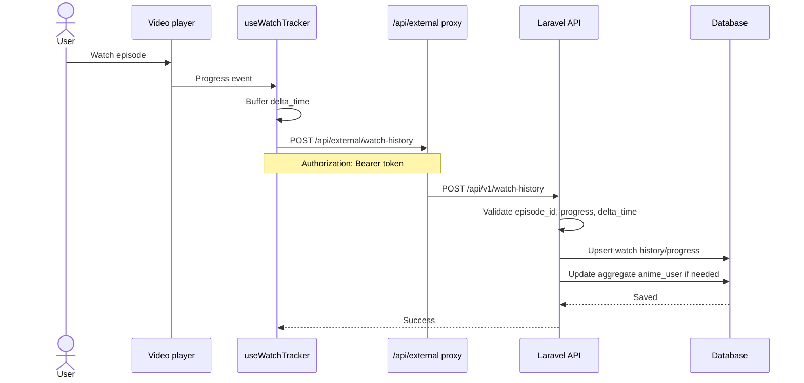
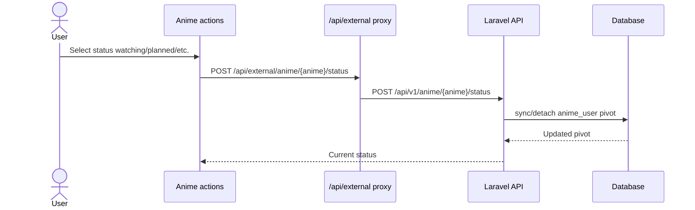
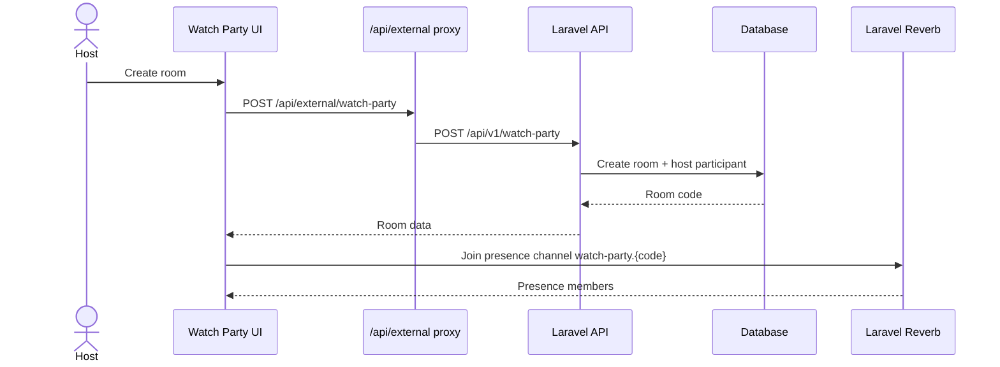
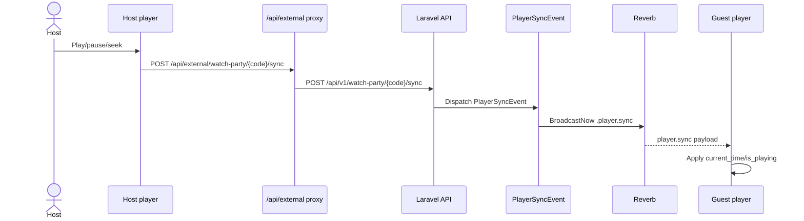
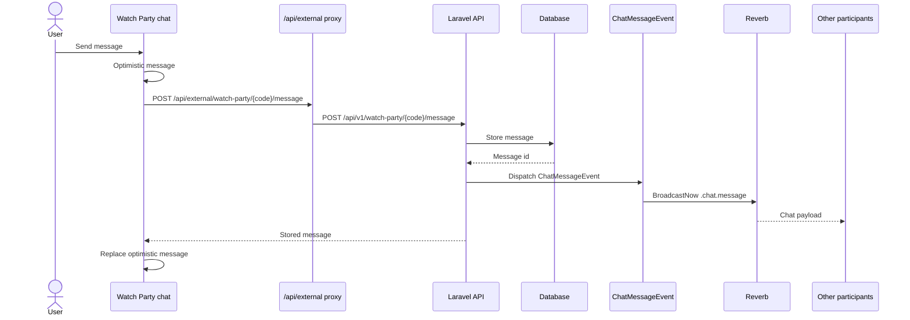
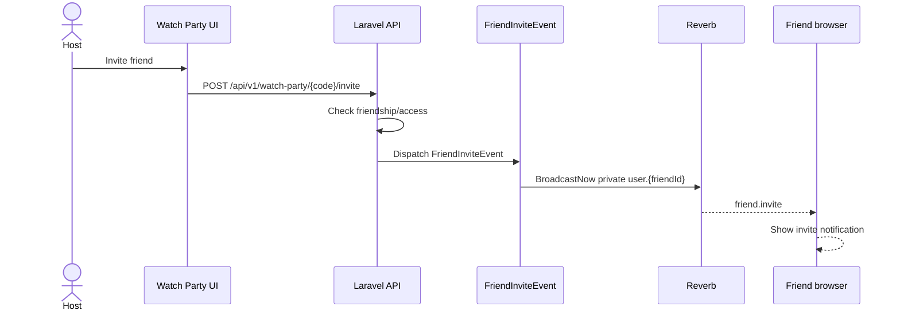
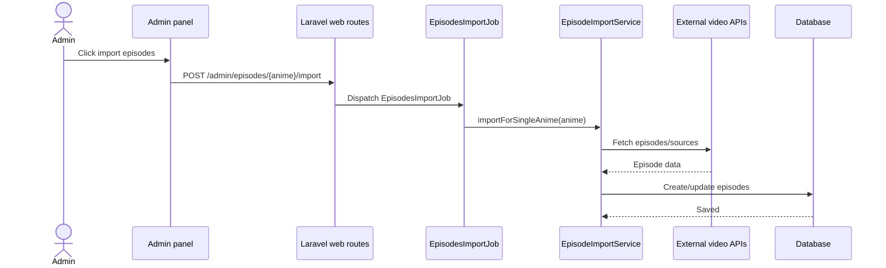
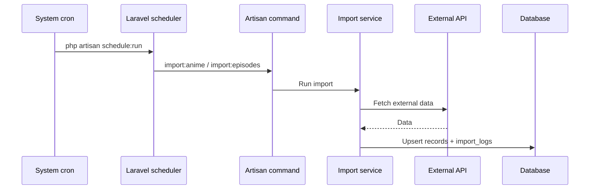

# Sequence diagrams

This document describes key runtime scenarios in Aniyume.

## 1. Login

## 2. Open anime page

## 3. Save watch progress

## 4. Add anime to list

## 5. Create Watch Party

## 6. Watch Party player sync

## 7. Watch Party chat

## 8. Friend invite to Watch Party

## 9. Admin episode import

## 10. Scheduled import

